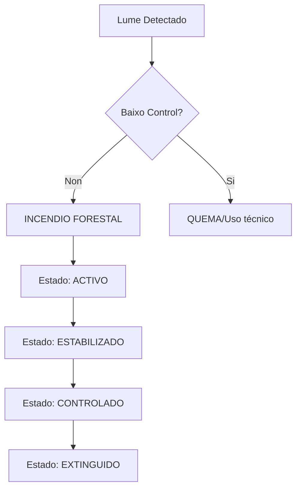

# Tema 1 Específico: Lei de Incendios e Estrutura Orgánica

## 🚨 MOMENTO CRÍTICO (El 20% que responde al 80%)

> [!IMPORTANT]
> **Pechos da biomasa (Art. 22):**
> *   **31 de maio:** Data límite xeral para a limpeza.
> *   **1 de abril:** Se o terreo estivo en situación de incumprimento nalgún dos 4 anos anteriores.

| Concepto | Dato Sniper | Proxeneta Legal |
| :--- | :--- | :--- |
| **Franxa Núcleos** | **50 metros** dende o peche ou edificación | Art. 21 |
| **Franxa Cámpings** | **50 metros** (Non pode haber especies disp. adicional 3ª) | Art. 21 |
| **Electricidade** | **5 metros** dende a proxección de condutores | Art. 21 |
| **Aviso Fogos** | **48 horas** (2 días) de antelación ao Distrito | Art. 37 |
| **Quemas Agrícolas** | Antelación: **2 días** mín. Validez: **7 días** | [EXAMEN] |
| **Quemas Forestais** | Antelación: **7 días** mín. Validez: **7 días** | [EXAMEN] |
| **Seguridade Quema** | **Devasa perimetral de 5m** de solo mineral | [EXAMEN] |
| **Prohibición Caza** | Ata o **31 decembro do 2º ano posterior** ao lume | Art. 47 |
| **ZOI** | **400 metros** arredor do monte (Franxa de influencia) | Art. 2 |
| **IGP / SIT** | **PEIFOGA** clasifica os lumes por gravidade (0-3) | [EXAMEN] |

---

## 🏗️ CONTIDO MAESTRO

### 1. Marco Lexislativo
*   **Lei 3/2007, de 9 de abril**: Norma básica de prevención e defensa contra incendios forestais en Galicia.
*   **PEIFOGA**: Plan Especial de Protección Civil ante Emerxencias por Incendios Forestais de Galicia. Integrado no PLADIGA.
*   **Obxecto**: Defender os montes e protexer as **persoas e bens** (Art. 1).
*   **Definicións Clave**:
    *   **Incendio Forestal**: Calquera lume que se estenda sen control sobre terreo forestal (Art. 2).
    *   **Tesela**: Mancha continua e homoxénea de vexetación.
    *   **Terreo Queimado**: Aquel afectado por un incendio forestal.

### 2. Estrutura Orgánica (Consellería do Medio Rural)
Segundo o Decreto 223/2022 e a súa modificación (148/2024):
*   **Servizos Centrais**:
    *   **Dirección Xeral de Defensa do Monte**: Órgano superior competente en prevención e extinción.
        *   **Subdirección Xeral de Prevención**: Risco e planificación preventiva.
        *   **Subdirección Xeral de Extinción**: Coordinación de medios e operativa.
    *   **Secretaría Xeral Técnica**: Inclúe as asesorías xurídicas.
*   **Servizos Periféricos**:
    *   **4 Xefaturas Territoriais**: A Coruña, Lugo, Ourense e Pontevedra.
    *   **19 Distritos Forestais**: Organización operativa de base (Ex: Distrito I Ferrol).
    *   **63 Demarcacións Forestais**: Subdivisión operativa mínima.

### 3. Planeamento de Defensa
1.  **PLADIGA**: Nivel Autonómico (Xunta). Publícase **anualmente** antes do 1 de xaneiro.
2.  **Plans de Distrito**: Ámbito operativo do distrito.
3.  **Plans Municipais**: Obrigatorios para concellos. Deben delimitar as fajas secundarias.

### 4. Xestión da Biomasa (Redes de Fajas)
*   **Primarias**: Estradas, vías férreas e infraestruturas enerxéticas/gas. Xestión pola entidade titular.
    *   **Autoestradas/Autovías**: Ata o **peche** (valla).
    *   **Estradas/Tren**: Ata o límite do **dominio público**.
    *   **Gas**: **3 metros** (1.5m a cada lado do eixe).
    *   **Electricidade**: **5 metros** dende a proxección externa (incl. vento).
*   **Secundarias**: Protección de núcleos, urbanizacións e industrias (50m). Xestión: **Concellos** (subsidiaria).
    *   **Xestión Subsidiaria**: O Concello dá **15 días** (notificación) antes de entrar de oficio.
*   **Terciarias**: Pistas forestais, devasas e áreas recreativas. Xestión: Xunta ou propietarios.

### 5. Uso do Fogo e Prohibicións
*   **Especies Prohibidas (DA 3ª)**: Pinos, eucaliptos e mimosas nas franxas de 50m.
*   **Quemas [EXAMEN]**:
    *   **Cualificación**: Restos agrícolas (comunicación) vs Forestais (autorización).
    *   **Horario Agrícolas**: Extinguidas ás **20:00h** (ou antes por vento).
    *   **Horario Forestais**: Entre o amencer e **2 horas antes** do ocaso.
    *   **App Oficial**: **XESTOR DE QUEIMAS**.
*   **IRDI (Risco Diario)**: Escala 1-5 (Baixo, Moderado, Alto, Moi Alto e Extremo).
    *   **ZAR**: Identificación obrigatoria se IRDI > Baixo (En Baixo NON hai obriga).
*   **Situacións Operativas (PEIFOGA) [EXAMEN]**:
    *   **Situación 0**: Só bens forestais. Medios locais/autonómicos.
    *   **Situación 1**: Afecta lixeiramente a poboación/bens non forestais.
    *   **Situación 2**: **Grave risco** para poboación/bens. Medios extraordinarios (UME).
    *   **Situación 3**: **Interese Nacional** (Ministro do Interior).
*   **IGP (Índice Gravidade Potencial)**:
    *   **IGP 0**: Sen ameaza a persoas. Dano forestal reducido.
    *   **IGP 1**: Ameaza a persoas alleas ou bens illados.
    *   **IGP 2**: Ameaza seria a núcleos ou infraestruturas.
    *   **IGP 3**: Circunstancias extremas de grave risco.

---

## 📊 DIAGRAMAS DE FLUXO

---

## 🔫 DATOS SNIPER (Para os Tests)

1.  **Axente da Autoridade**: O Director de Extinción ten esta condición legal.
    *   **Poderes Emerxencia**: Pode dispoñer de **augas privadas** e abrir **brechas en muros** sen permiso se fose preciso.
2.  **Prohibición de Pastoreo**: Igual que a caza, ata o **31 de decembro do 2º ano posterior** (salvo autorización excepcional).
3.  **Sancións (Competencia)**:
    *   **Moi Graves**: Resolve o **Consello da Xunta**.
    *   **Graves / Leves**: Resolve a **Xefatura Territorial** (Xefe/a Territorial).
    *   **Multas Coercitivas**: Non poden ser superiores ao **20%** da sanción principal.
4.  **Director do PMA**: En Situación 0 e 1 é o **DTE**; en Situación 2 é designado pelo Director do Plan.
5.  **DTE Hierarchy**: Director Técnico de Extinción. Orde: Técnico > Axente > Xefe Brigada.
6.  **SEMOP Levels**: Nivel A (Ataque Inicial), Nivel B (Ataque Ampliado/Sectores), Nivel C (Ataque Avanzado/Complexo).
7.  **Consello da Xunta**: Responsable de aprobar o PLADIGA.
8.  **Distancias Gas**: Franxa de **3 metros** (1.5m a cada lado do eixe).

---

## 📋 GLOSARIO DE SIGLAS
*   **SPIF**: Servizo de Prevención de Incendios Forestais.
*   **PLADIGA**: Plan de Prevención e Defensa contra os Incendios Forestais de Galicia.
*   **PEIFOGA**: Plan Especial de Protección Civil ante Emerxencias por Incendios Forestais de Galicia.
*   **SEMOP**: Sistema Estrutural de Mando Operativo.
*   **IRDI**: Índice de Risco Diario de Incendio.
*   **ZAR**: Zona de Alto Risco.
*   **ZOI**: Zona de Influencia Forestal (400 m).
