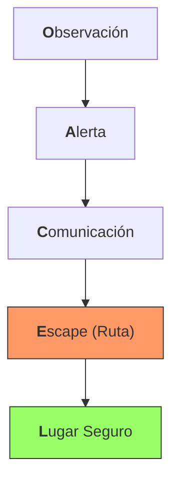
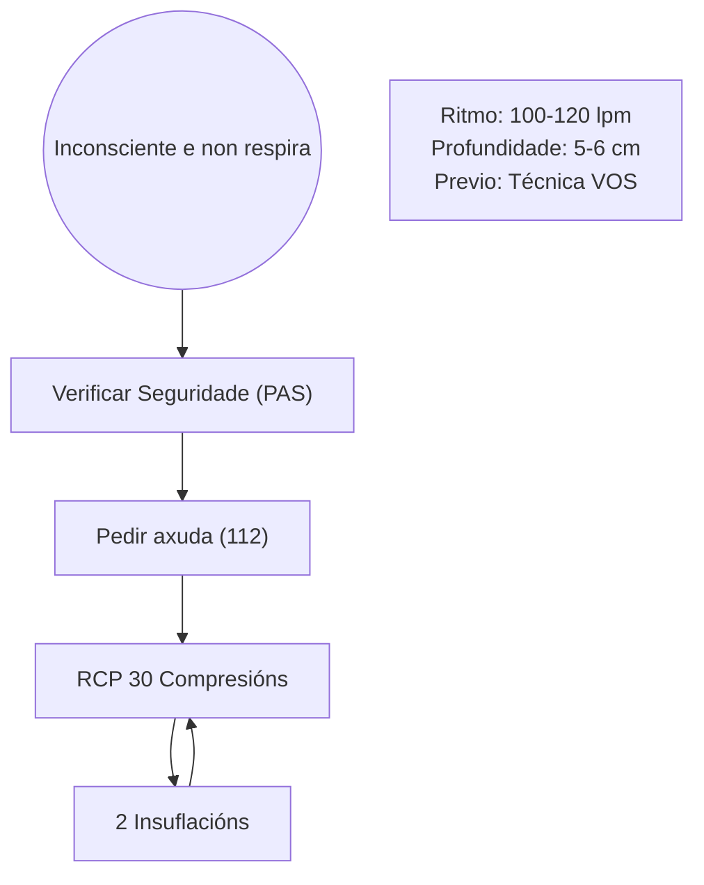
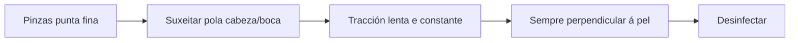

# Tema 10: Seguridade e Primeiros Auxilios (Manual SPIF) 🚑🩺💎

---

## **CAPÍTULO 1: PROTOCOLOS DE SEGURIDADE OPERATIVA**

> [!NOTE]
> **Marco Mental Operativo:** Este capítulo non é unha lista de normas, é o sistema operativo mental para sobrevivir a un incendio forestal. A seguridade non é unha opción, é a condición previa para calquera acción de extinción. A base de todo é o protocolo **OACEL**, que estrutura a toma de decisións en tempo real para evitar atrapamentos, a principal causa de mortalidade.

### **1.1. MATRIX DE AVALIACIÓN DE RISCOS (METODOLOXÍA XUNTA)**

O SPIF utiliza unha matriz para decidir se unha tarefa pode realizarse. (Nota: A "Notificación á autoridade laboral" NON é unha fase desta metodoloxía).

| Nivel de Risco | Definición Técnica | Acción Requirida (Xunta) |
| :--- | :--- | :--- |
| **Tolerable (T)** | Risco baixo. | Non se require acción específica, pero si vixilancia. |
| **Moderado (M)** | Risco medio. | Precisa medidas de control e planificación. |
| **Importante (I)** | Risco alto. | **NON COMEZAR A TAREFA** ata que o risco se reduza. |
| **Intolerable (IN)** | Risco extremo. | **SUSPENDER INMEDIATAMENTE** calquera actividade. |

> [!CAUTION]
> **Estatística Crítica:** Entre **1991 e 2015** faleceron **147 persoas** en labores de extinción en España. A seguridade non é negociable.

### **As 10 Normas de Seguridade Estándar**

1.  **Manterse informado** sobre as condicións meteorolóxicas e o seu prognóstico.
2.  **Coñecer o comportamento do lume** en cada momento.
3.  **Basear todas as accións no comportamento actual e esperado** do lume.
4.  **Identificar rutas de escape** e dalas a coñecer a todo o persoal.
5.  **Manter un posto de observación** cando haxa posibilidade de perigo.
6.  **Manterse alerta, calmado, pensar claramente e actuar con decisión.**
7.  **Manter communication constante** con compañeiros, xefes e unidades adxacentes.
8.  **Dar instrucións claras e asegurarse de que se entenden.**
9.  **Manter o control do persoal** en todo momento.
10. **Combater o lume con determinación**, priorizando sempre a seguridade.

### **As 18 Situacións de Risco (CLIF)**

Estas son as bandeiras vermellas operativas. Se se detecta unha, a acción debe parar e re-avaliarse inmediatamente.

| Nº | Situación de Risco | Análise Táctica |
| :--- | :--- | :--- |
| **1** | Incendio non explorado nin dimensionado. | Actuar a cegas é a vía rápida ao desastre. Compromete a seguridade. |
| **2** | Atópase nun país descoñecido e sen coñecer os factores locais que inflúen no comportamento do lume. | Descoñecer a topografía, combustibles locais ou ventos dominantes é unha trampa mortal. |
| **3** | Non se ten información sobre a meteoroloxía e os factores locais. | O tempo é o motor do lume. Sen previsión, non hai seguridade. |
| **4** | Non se pode ver a parte principal do lume ou non se está en contacto con alguén que poida velo. | Perda de conciencia situacional. É unha situación de risco grave. |
| **5** | Non se está informado sobre a estratexia e táctica que se está a seguir. | A falta de coordinación leva a accións contraproducentes e perigosas. |
| **6** | As instrucións e asignacións de tarefas non están claras. | Ordes ambiguas provocan erros. Requírese confirmación de recepción. |
| **7.1** | Non hai comunicación co teu persoal ou xefe. | Rotura da cadea de mando. Estás illado e vulnerable. |
| **7.2** | A comunicación cos membros da mesma unidade está cortada. | A unidade queda fragmentada e sen capacidade de resposta coordinada. |
| **8** | Constrúese una liña de defensa sen un punto de ancoraxe seguro. | O lume pode flanquear a liña e atrapar ao persoal. |
| **9** | **Constrúese unha liña de defensa costa abaixo cara ao incendio.** | Unha das manobras máis perigosas. O lume ascende moito máis rápido que a capacidade de escape. |
| **10** | **Téntase un ataque frontal (á cabeza) do incendio.** | Zona de máxima intensidade e velocidade. Altísimo risco de atrapamento. |
| **11** | Hai combustible sen queimar entre o persoal e o lume. | Ese combustible é o camiño que o lume usará para chegar a ti. |
| **12** | Non se pode ver o lume e non se usa a man sobre as costas para saber cara onde vai a calor. | Perda de referencias sensoriais básicas. |
| **13** | Trabállase nun terreo onde o material rodante pode prender por debaixo do persoal. | Creación de focos secundarios que cortan a ruta de escape. |
| **14** | O tempo vólvese máis quente e seco. | Aumenta a dispoñibilidade do combustible e a probabilidade de comportamento extremo. |
| **15** | O vento aumenta de velocidade e/ou cambia de dirección. | O factor máis imprevisible e perigoso. Pode cambiar o rumbo e a velocidade do lume en segundos. |
| **16** | Producen focos secundarios frecuentes e a longa distancia. | Indica inestabilidad atmosférica e un comportamento do lume moi perigoso. |
| **17** | O terreo e o combustible dificultan o escape a unha zona segura. | A ruta de escape non é viable. |
| **18** | Séntese ganas de durmir ou descansar preto da liña de lume. | O esgotamento reduce a capacidade de reacción. Unha pausa debe facerse nunha zona segura. |

É o sistema proactivo de seguridade para minimizar o risco de atrapamento. Aplícase de forma continua e interrelacionada.

| Componente | Descrición Técnica | Detalles Operativos |
| :--- | :--- | :--- |
| **O**bservación | Vixilancia constante do lume, meteoroloxía e topografía. **Require un ou varios observadores** en lugar seguro e con boa visibilidade. | Detectar cambios no vento, focos secundarios, material rodante, comportamento do lume. |
| **A**lerta | Estar consciente dos acontecementos e poñer a observación en relación coa seguridade do persoal. | Analizar a información do observador e tomar decisións proactivas, non reactivas. |
| **C**omunicación | Manter canles de comunicación abertas e eficaces entre observadores, mandos e persoal. | A información debe fluír en ambos sentidos. Confirmar a recepción de mensaxes críticas. |
| **E**scape (Ruta de) | Vía **previamente identificada, limpa e avaliada** para abandonar a zona de traballo de forma segura. | Debe conducir a un Lugar Seguro. A súa viabilidade debe re-avaliarse constantemente. |
| **L**ugar Seguro | Área onde o persoal pode soportar o paso do lume **só co seu EPI**. Libre de combustible ou con carga moi baixa. | A zona queimada (fría) é o lugar seguro por excelencia. O seu tamaño depende do combustible e da pendente. |

- **Distancia de Separación Segura (Regra de Seguridade):** A distancia entre o persoal e as chamas debe ser, como mínimo, **16 veces a altura da CHAMA** (non da vexetación). Este é un dato crítico para evitar o atrapamento por radiación.

### **1.2. MANTEMENTO E USO DOS EPI**

O coidado do equipo determina a súa eficacia protectora:
*   **Lavado:** Os traxes ignífugos de **Aramidas/Nomex** deben lavarse sempre con **deterxentes neutros**. O uso de lixivias ou suavizantes destrúe a propiedade ignífuga.
*   **Casco (Badana):** A badana interior ten dúas funcións: **fixación** do casco á cabeza e **absorción da suor**.
*   **Ladeira:** No transporte de ferramentas por ladeira, estas deben levarse sempre pola **man da ladeira arriba**. 
*   **Liquidación:** Os troncos deben deixarse **perpendiculares á pendente** para evitar que roden ladeira abaixo.

### **1.3. SEGURIDADE EN MAQUINARIA MOTORIZADA (ROZADORA)**

O uso de rozadoras esixe parámetros de seguridade estritos para evitar accidentes con obxectos proxectados ou cortes:
*   **Distancia de Seguridade:** Manter un radio mínimo de **15 metros** entre o operario e calquera outra persoa.
*   **Altura de Traballo:** O disco debe traballar a unha altura de entre **10 e 20 cm** do chan.
*   **Zona de Perigo do Disco:** A área máis crítica por proxeccións e rebotes sitúase entre as **15:00h e as 18:00h** (seguindo as agullas do reloxo respecto ao operario).
*   **Mantemento EPI:** Os traxes de Aramida/Nomex deben **secase á sombra**, xa que o sol directo degrada as fibras polímeras.

### **1.4. CONDUCIÓN DE EMERXENCIA (CIRCULAR 2/21)**

| **Situación** | Límite de Velocidade |
| :--- | :--- |
| **Vía Pública (Emerxencia)** | **Ata un 50% superior** ao límite da vía. |
| **Pistas/Obras (Emerxencia)** | **MÁXIMO 30 km/h** por riba do límite. |
| **Cinto de Seguridade** | **OBRIGATORIO** sempre, sen excepcións. |
| **Luces do Vehículo** | Deberán manterse as **luces de posición e de cruce (curtas)** acendidas, ademais das de emerxencia, para garantir a visibilidade a través do fume. |
| **Autoprotección (Auga)** | Reserva mínima de **1000 litros** de auga no tanque. |
| **Autoprotección (Cono)** | Ángulo do cono de auga de **60 graos** para protección eficaz. |

---

## **CAPÍTULO 2: PRIMEIROS AUXILIOS - PROTOCOLOS DE COMBATE**

> [!NOTE]
> **Marco Mental Operativo:** A asistencia sanitaria profesional tardará en chegar. A túa actuación inicial, baseada no protocolo **PAS**, pode determinar a supervivencia dun compañeiro. Os coñecementos obsoletos (Libro Laranxa 2007) son perigosos; só os protocolos actuais (Mauro V8, Ficha 31) son válidos.

### **Secuencia de Actuación PAS**

> [!IMPORTANT]
> **Protexer, Avisar, Socorrer (PAS)**
> É a secuencia obrigatoria ante calquera accidente. A auto-protección é o primeiro paso para non converterse noutra vítima.
> 1.  **Protexer:** Asegurar a zona para ti, para o entorno e para o ferido.
> 2.  **Avisar:** Chamar ao **112** (número único de emerxencias) e/ou usar a canle de radio do operativo.
> 3.  **Socorrer:** Aplicar os primeiros auxilios segundo a túa formación e os medios dispoñibles.

### **Locais de Primeiros Auxilios**
Nos centros de traballo con máis de **50 traballadores**, é obrigatorio un local de primeiros auxilios que conteña:
*   **Caixa de urxencias** completa.
*   **Padiola** (camilla).
*   **Fonte de auga** potable.

### **Reanimación Cardiopulmonar (RCP)**

Protocolo a iniciar cando unha persoa está inconsciente e non respira. Antes de iniciar as manobras, debe aplicarse a técnica **VOS**:
*   **V**er: Se o peito sobe e baixa.
*   **O**uvir: O aire saír pola boca/nariz.
*   **S**entir: O alento na túa cara.

> [!IMPORTANT]
> **Métricas e Protocolo de RCP (ADULTOS)**
> | Parámetro | Valor Técnico (Mauro V8) | Notas Operativas |
> | :--- | :--- | :--- |
> | **Ratio Compresións:Insuflacións** | **30 : 2** | Válido para 1 ou 2 reanimadores. Ratios antiguos (15:2, 5:1) están obsoletos. |
> | **Frecuencia de Compresións** | **100 - 120 por minuto** | Ritmo similar á canción "Stayin' Alive". |
> | **Profundidade de Compresións** | **5 - 6 cm** | Comprimir o esternón con decisión. |
> | **Posición do Reanimador** | Brazos rectos e **bloqueados polos cóbados**. | O peso debe caer dende os ombros sobre o esternón da vítima. |
> | **Manobra de Apertura Vía Aérea** | Hiperextensión do pescozo (manobra fronte-queixo). | |

### **Hemorraxias e Feridas**

> [!IMPORTANT]
> **Identificación Visual de Hemorraxias (Mauro V8)**
> | Tipo | Cor do Sangue | Tipo de Saída |
> | :--- | :--- | :--- |
> | **Arterial** | Vermella rutilante (viva) | A cachón, intermitente (sincronizada co pulso) |
> | **Venosa** | Vermella escura | Continua, uniforme |
> | **Capilar** | Vermella | En sábana, puntos sangrantes |

**Clasificación Técnica de Feridas:**
- **Incisa:** Producida por obxectos con fío. Predomina a lonxitude sobre a profundidade. Corte limpo.
- **Contusa:** Producida por golpes con obxectos rombos. Bordos irregulares e hematoma.
- **Punzante:** Producida por obxectos con punta. Predomina a profundidade sobre a superficie.
- **Bocado / Esgazadura:** Desprendemento parcial de tecidos con bordos moi irregulares.

**Protocolo de Actuación ante Hemorraxias Externas:**
1.  **Compresión Directa:** Aplicar presión forte e constante sobre a ferida cun apósito limpo durante polo menos 10 minutos.
2.  **Elevación do Membro:** Se a ferida está nunha extremidade, elevala por enriba do nivel do corazón.
3.  **Compresión Arterial:** Se o anterior non funciona, comprimir a arteria principal (umeral no brazo, femoral na ingua).
4.  **Torniquete:** **ÚLTIMO RECURSO.** Só en casos de amputación ou hemorraxia masiva que non se controla. Anotar hora.

**Hemorraxias Internas:** Poden cursar con mareos e perda de consciencia. 
*   **Traslado:** Colocar a **cabeza ladeada** para evitar a asfixia por vómitos.

**Actuación en Feridas Penetrantes Específicas:**

| Localización | Protocolo de Actuación | Posición da Vítima |
| :--- | :--- | :--- |
| **Tórax** | Tapar a ferida cun material non transpirable (plástico) selado por 3 lados (válvula). Evita o **Pneumotórax a tensión**. | Semisentada. |
| **Abdome** | Cubrir con pano limpo e húmido. **NUNCA quitar obxectos cravados nin reintroducir vísceras.** | Decúbito supino coas pernas flexionadas. |

### **2.2. PROTOCOLOS ESPECÍFICOS DE RESCATE (LIBRO LARANXA)**

En situacións especiais de rescate, deben seguirse estes procedementos literais:

*   **Rescate en Gabia:** Para izar ao ferido, deben usarse **3 ou 4 tiras de tea ou cordas** colocadas baixo as zonas clave (pescozo, costas, cadeira e pés) para tensar e elevar de forma simultánea e horizontal.
*   **Rescate Baixo Vehículo:** Se non hai medios pesados, usaranse **gatos** de vehículos para elevar a carga. Para extraer á vítima, colocarase sobre unha **manta cunha corda atada aos pés** e usarase outro conxunto de tiras transversais para o tiro.
*   **Rescate en Árbore:** Deberase pasar unha corda por unha **póla resistente situada por riba** do ferido e fixala mediante un nó de seguridade por debaixo das **axilas** para realizar o descenso controlado.

### **Queimaduras**

| **1º Grao** | Pel arroibada, dor intensa (**Eritema**). | Arrefriar con auga abundante (mín. 10 min). |
| **2º Grao**| Ampolas con líquido claro (**Flictemas**), dor intensa. | Arrefriar con auga (mín. 10 min). **NON rebentar as ampolas.** |
| **3º Grao**| Destrución da pel, aspecto acartonado (**Escara**). **Non hai dor**. | Arrefriar con auga abundante (20-30 min). Cubrir con gasas húmidas. |

**Regra dos 9 de Wallace (Avaliación da Superficie Queimada):**
*   **Cabeza e Pescozo:** 9%
*   **Tronco Anterior:** 18% | **Tronco Posterior:** 18%
*   **Cada Extremidade Superior:** 9%
*   **Cada Extremidade Inferior:** 18%
*   **Xenitais:** 1%

### **2.1. REGRAS DE OURO EN LESIÓNS ESPECÍFICAS**

*   **Luxacións:** **NUNCA** intentar reducila (non poñer o óso no seu sitio).
*   **Corpos Estraños:** **PROHIBIDO** quitar obxectos cravados (fan efecto tapón e evitan a hemorraxia masiva).

### **Precaucións con Aeronaves (Helicópteros)**

*   **Radio de Prohibición:** Non fumar nin facer lume a menos de **50 metros** do aparello (Límite oficial de seguridade).
*   **Aproximación:** Achegarse e afastarse **sempre agachado** (polo rotor) e pola **zona frontal**, á vista do piloto.
*   **Embarque:** Nunca achegarse polo rotor de cola nin pola parte traseira.

| Situación | Signos de Alerta | Actuación Inmediata |
| :--- | :--- | :--- |
| **Atragantamento (obstrución completa)** | A vítima non pode falar, tusir nin respirar. Leva as mans ao pescozo. | **Manobra de Heimlich:** Compresións abdominais bruscas cara atrás e cara arriba. |
| **Autoprotección (Ángulo)** | Protexerse no chan ante a pasaxe de chamas. | O antebrazo debe colocarse nun ángulo de **90º respecto ao chan** para protexer a cara. |
| **Golpe de Calor** | Pel quente, seca e arroibada. Alteración da conciencia. Ausencia de suor. | **URXENCIA VITAL.** Trasladar a un lugar fresco, quitar roupa, arrefriar o corpo con panos húmidos. Chamar ao 112. |
| **Insolación** | Pel quente e húmida. Sudación abundante. Dor de cabeza, náuseas. | Levar a un lugar fresco e á sombra. Hidratar con pequenos sorbos de auga se está consciente. |

---

## **CAPÍTULO 3: RISCOS ESPECÍFICOS E ZOONOSES**

> [!NOTE]
> **Marco Mental Operativo:** Este capítulo aborda ameazas específicas do medio onde o coñecemento obsoleto non só é incorrecto, senón activamente perigoso. Os protocolos para mordeduras e picaduras foron actualizados radicalmente. A literalidade dos procedementos modernos é crítica para o exame e para a seguridade real.

### **Mordeduras de Ofidios (Serpes)**

> [!IMPORTANT]
> **Identificación da Mordedura (Mauro V8)**
> | Especie | Marca da Mordedura | Sintomatoloxía Inicial |
> | :--- | :--- | :--- |
> | **Víbora (Velenosa)** | **Dous puntos sangrantes** (cairos). | Dor intensa e **inflamación rápida** da zona. |
> | **Cobra (Non velenosa)** | **Ringleira de puntiños sangrantes.** | Xeralmente sen dor nin inflamación inmediata. |

> [!WARNING]
> **PROTOCOLO OBSOLETO E PERIGOSO (Libro Laranxa 2007)**
> O procedemento de `realizar incisións en forma de X` e `succionar o veleno` está **TERMINANTEMENTE PROHIBIDO**. Causa máis danos (infeccións, lesións nerviosas) e non é efectivo.

> [!IMPORTANT]
> **PROTOCOLO VIXENTE OBRIGATORIO (MAURO V8 / Ficha 31)**
> 1.  **Manter a calma** e tranquilizar á vítima.
> 2.  **Inmobilizar a extremidade afectada** para retardar a diseminación do veleno.
> 3.  **Aplicar frío local** (panos con auga fría, nunca xeo directo sobre a pel).
> 4.  **Traslado urxente** a un centro hospitalario.

### **Picaduras de Carrachas (Garrapatas)**

- **Taxonomía:** É un **Arácnido / Ácaro** de alimentación hematófaga. Pode transmitir a Enfermidade de Lyme.

> [!WARNING]
> **MÉTODOS PROHIBIDOS E INEFICACES (Libro Laranxa 2007 / Tradicionais)**
> Está **TOTALMENTE PROHIBIDO** o uso de:
> - Gasolina, gasóleo, petróleo.
> - Aceites, vaselina.
> - Alcohol, esmalte de uñas.
> - Queimar ou esmagar a carracha.
> Estes métodos provocan que a carracha regurxite o seu contido, aumentando drasticamente o risco de infección.

> 3.  **Realizar unha tracción continua, lenta e progresiva, en perpendicular á pel.** Non retorcer.
> 4.  Unha vez extraída, **lavar con auga e xabón** e aplicar un **antiséptico** (iodo/alcohol).
> 5.  Lavar ben as mans e anotar a data e zona da picadura.

### **Ataque de Vespa Velutina (Avispa Asiática)**

**Protocolo de Actuación (ISSGA):**
- **Se te atacan:** Fuxe o máis rápido posible e busca refuxio (vehículo, edificación).
- **Mentres escapas:** Protexe as zonas sensibles (cara, pescozo) coas mans ou roupa.
- **NON intentes esmagalas nin axitar os brazos:** Os movementos bruscos atráenas e as esmagadas liberan feromonas de ataque.
- **Se ves a alguén sendo atacado:** **NON te achegues.** Chama inmediatamente ao **112**.
- **Prevención:** Antes de traballar, realizar un recoñecemento da parcela. Se atopas un niño, non te achegues a menos de **5 metros** e avisa ao **012**.

---

## **Matriz de Seguridade 🚨**

### **Punto de Fricción → Resposta Blindada**

| Punto de Fricción (Trampa de Exame) | Resposta Blindada (Protocolo Vixente) |
| :--- | :--- |
| **Mordedura de Víbora:** Que facer coa ferida? | **NUNCA INCISIÓNS NIN SUCCIÓN.** Protocolo: Inmobilización, frío local e traslado urxente. |
| **Picadura de Carracha:** Como se extrae? | **NUNCA GASOLINA/ACEITE.** Protocolo: Con pinzas de punta fina, tracción lenta e perpendicular. |
| **Ritmo de RCP:** Cantas compresións e insuflacións? | **30:2**. Os ratios 15:2 e 5:1 son obsoletos e incorrectos. |
| **Cinto de Seguridade:** Está exento o persoal de extinción? | **NON.** O seu uso é **OBRIGATORIO** sen excepcións (Circular 2/21). |
| **Construción de Liña:** Como se traballa nunha ladeira? | **SEMPRE COSTA ARRIBA.** Construír unha liña costa abaixo cara ao lume é unha situación de risco extremo (Nº 9 CLIF). |
| **Descarga Aérea:** Que facer se non dá tempo a retirarse? | **PROTEXERSE NO CHAN.** Deitarse boca abaixo co casco posto, tapando o pescozo. Nunca correr sen rumbo nin refuxiarse baixo árbores queimadas. |
| **Ataque de Vespa Velutina:** Axudar a un compañeiro atacado? | **NON ACHEGARSE.** A prioridade é llamar ao 112 para activar a resposta de emerxencia. |
| **Ferida Torácica:** Como se tapa? | Con material **NON TRANSPIRABLE** (plástico) selado por **3 LADOS** para crear un efecto válvula. |

### **Flash-Métricas**

| Concepto | Métrica | Fonte |
| :--- | :--- | :--- |
| Frecuencia RCP | **100 - 120 compresións/min** | Mauro V8 |
| Profundidade RCP | **5 - 6 cm** | Mauro V8 |
| Ratio RCP (Adultos) | **30 : 2** | Estándar Actual |
| Velocidade de Escape (OACEL) | **80 m/min** (sen pendente) | Mauro V8 |
| Seguridade en Aeronaves | **50 metros** (distancia sen lume/fume) | Mauro V8 |
| Peso Máx. Home (Ocasional) | **40 kg** | ISSGA |
| Peso Máx. Home (Habitual) | **25 kg** | ISSGA |
| Peso Máx. Muller (Ocasional) | **20 kg** | ISSGA |
| Peso Máx. Muller (Habitual) | **15 kg** | ISSGA |
| Arrefriar Queimadura Leve | **Mínimo 10 minutos** | Ficha 31 |
| Arrefriar Queimadura Grave | **20 - 30 minutos** | Ficha 31 |
| Distancia Seguridade Vespa Velutina | **Mínimo 5 metros** do niño | ISSGA |