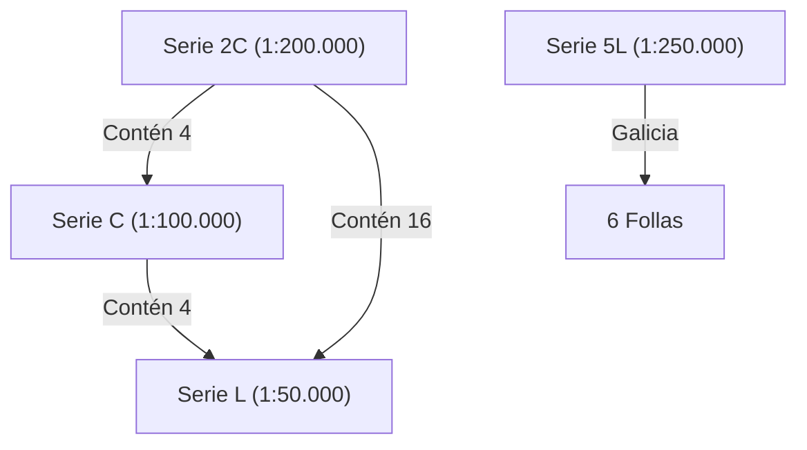
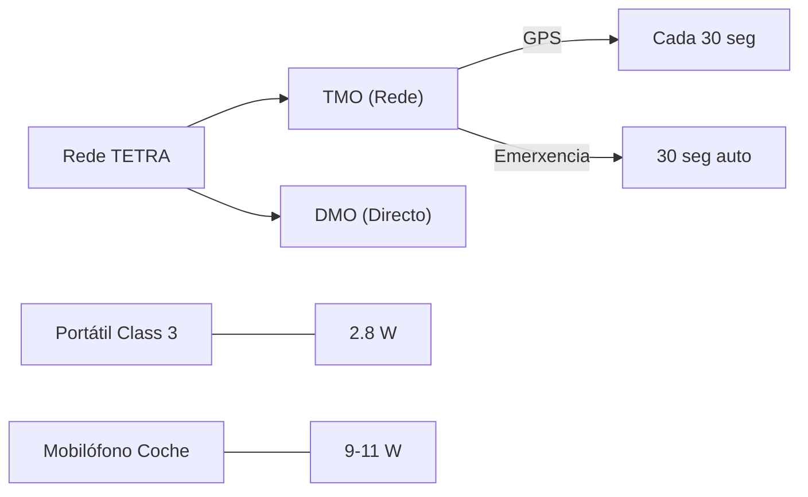

# Resumo: Comunicacións e Cartografía

Uso da rede de comunicacións TETRA e fundamentos de orientación, mapas e sistemas de coordenadas xeográficas.

---

## 🗺️ CAPÍTULO 1: CARTOGRAFÍA E ORIENTACIÓN

### 1.1. Fundamentos e Jerarquía de Series do SGE
A cartografía oficial en España organízase mediante unha xerarquía estrita de follas do **SGE** (**Servizo Geográfico del Ejército**) e do **IGN** (**Instituto Geográfico Nacional**):
- **Serie 2C (1:200.000):** Unha folla desta serie comprende **catro** da serie C.
- **Serie C (1:100.000):** Unha folla desta serie comprende **catro** da serie L.
- **Serie L (1:50.000):** A máis usada en detalle. Consta de **1.130 follas** para cubrir todo o territorio peninsular. Unha folla 2C contén, por tanto, **16 follas** da serie L.
- **Serie 5L (1:250.000):** É a serie utilizada para cubrir **Galicia** con **6 follas**.

> [!IMPORTANT]
> **Orixe de Coordenadas:** O Meridiano 0 (Greenwich) é a base. Todas as cotas teñen como referencia o nivel medio do mar en **Alicante**.

### 1.2. Sistemas de Referencia e Proxeccións
- **Dátum Oficial:** Conxunto de parámetros (Elipsoide + Punto fundamental) para definir a posición. Actualmente o **ETRS89** (RD 1071/2007). Antes usábase o **ED50** (Europeo 1950).
- **Elipsoide de Referencia:** O **Hayford ou Internacional** é o máis usado en España.
- **Proxección UTM (Universal Transverse Mercator):** Proxección cilíndrica tanxente ao Ecuador. Deforma máis ao achegarse aos polos.
- **Proxección UPS (Universal Polar Stereographic):** Proxección **cónica** específica para representar as **rexións polares**, evitando o erro da UTM.
- **Orixe de Coordenadas:** O Meridiano 0 (Greenwich) é o sistema de medición angular **sesaxesimal**. Todas as cotas teñen como referencia o nivel medio do mar en **Alicante**.

### 1.2. Relevo e Conceptos Avanzados
- **Curvas de Depresión:** Indican hoxas ou dolinas (trazos cara ao interior).
- **Prominencia Topográfica (Factor Primario):** Desnivel mínimo que hai que descender desde un cume para poder ascender a outro máis alto.
- **Sombreado Oblicuo:** Luz a **45º** desde o **NO (Noroeste)** para dar relieve 3D.
- **Mértodo da Grella:** División do terreo en cadrados. Ex: "Lanzar en 7 A e B" significa descargar sobre a **cabeza do lume** desde Alfa cara a Bravo.

### 1.3. Técnicas de Orientación e Navegación
*   **A Brúxula:** Agulla imantada que sinala o **Norte Magnético** (actualmente móvese cara a Siberia a unha velocidade de **40 km/ano**). A corrección chámase **declinación magnética**.
*   **Método da Sombra:** Un pau no chan. Marcas cada 15-30 min. A unión da 1ª marca á 2ª indica o **Leste**.
*   **Método do Reloxo:** Hora solar. Apuntar horaria ao sol. A **bisectriz** entre a horaria e as 12 indica o **Sur**.
*   **Orientación pola Lúa:**
    *   **Lúa Chea:** Ás 00:00 está ao **Sur**.
    *   **Cuarto Crecente:** Ás 00:00 está ao **Oeste**.
    *   **Cuarto Menguante:** Ás 00:00 está ao **Leste**.
*   **Orientación por Indicios:**
    *   **Musgo/Líquenes:** Lado **Norte** (máis sombra/humidade).
    *   **Tocóns:** Aneis máis apertados no **Norte** (menos crecemento), máis separados no Sur.
    *   **Formigueiros:** Boca orientada cara ao **Sur**.

---

## 📡 CAPÍTULO 2: COMUNICACIÓNS (TETRA)

### 2.1. Teoría de Radio e Conceptos Base
*   **Velocidade:** As ondas viaxan á **velocidade da luz** (aprox. 300.000 km/s).
*   **Transdutores:** 🎙️ **Micrófono** (Son -> Elec) | 🔊 **Altofalante** (Elec -> Son).
*   **Squelch:** 🤐 Silenciador de ruído de fondo.
*   **Bandas de Frecuencia:**
    *   **VHF (Very High Frequency):** 30-300 MHz (Medios aéreos).
    *   **UHF (Ultra High Frequency):** 300-3000 MHz (**Rede TETRA**).

> [!TIP]
> **Modulación:** A banda aérea usa **AM** (Amplitude), mentres que a radio convencional adoita usar **FM** (Frecuencia).

### 2.2. Terminoloxía Administrativa (Criba de Exame)
- **Alarma de Incendio:** É o que comunica un vixiante fixo ao detectar un fume. **NUNCA di "teño un incendio"**, senón que comunica unha alarma.
- **Triple C:** As comunicacións deben ser **Claras, Curtas e Concisas**.
- **OCELA:** Protocolo de seguridade básica (Observación, Comunicación, Escape, Lugar seguro e **Atención**).

### 2.2. Fraseoloxía Aérea e Descargas
As aeronaves usan códigos específicos para informar da zona de descarga:
- **Fox-trot (F):** Refírese á **Cola** do incendio.
- **Sierra (S):** Refírese á **Cabeza** do incendio.
- **Cuadrantes:** Divídese en flanco dereito (1 e 3) e esquerdo (2 e 4).
    - **F4:** Verde na cola do flanco esquerdo.
    - **S1:** Chama na cabeza do flanco dereito.
- **Deletreo de Decimais:** O número 11.60 en banda aérea deuse como: **uno-uno-seis-cero-cero**.

### 2.4. Táboa de Frecuencias Aéreas en Galicia
| Zona / Uso | Frecuencia (MHz) |
| :--- | :--- |
| **Emerxencia / Reserva (Galicia)** | **129.825** |
| **Lugo (Asignada - Test Unidade 5)** | **122.350** |
| **Principal Incendio Lugo (Test Aula)** | **130.500** |
| **Rango Banda Aérea** | 118.000 - 136.975 MHz |
| **Modulación** | **AM** (Amplitude Modulada) |

---

### 2.5. Hardware e Botonoloxía Específica

#### **Comportamento de LEDs (Diferencia Crítica)**
- **Motorola (MTP 3550):** LED á **dereita**. **Vermello fixo** = Fóra de servizo. **Verde fixo** = En servizo.
- **Sepura (STP 9038):** LED á **esquerda**. **Vermello fixo** = Fóra de servizo.
- **En uso:** Ambos iluminan o LED cando están transmitindo/recibindo.

#### **Sepura STP 9038 (Material de Exame)**
A pesar de ser un terminal antigo, aparece en test pola súa complexidade:
- **Bloqueo:** Pulsar botón **asterisco (*)** e despois botón **Menú (Aceptar)**.
- **ISSI:** Visualízase na parte **superior esquerda** da pantalla.
- **Función Repetidor:** **ESTE EQUIPO NON ADMITE MODO REPETIDOR**.
- **Localización Botón Emerxencia:** Parte superior, ao lado da antena.

#### **Rede dixital TETRA: Modos e Potencias**
*   **TMO (Trunked Mode Operation):** Uso de repetidores. Permite xeolocalización e comunicación con centros. Envío GPS cada **30 segundos**.
*   **Emerxencia TMO:** Activa **30 segundos** de transmisión automática sen necesidade de manter o PTT.
*   **DMO (Direct Mode Operation):** Comunicación terminal a terminal sen repetidores.
*   **Gateway (Pasarela):** Un terminal móbil (coche) fai de ponte entre DMO e TMO.
*   **Repeater (Repetidor DMO):** Un terminal repite a sinal DMO para aumentar alcance.
*   **Potencia Terminal Portátil:** **2.8 W** (Clase 3 segundo PPT 2024).
*   **Potencia Mobilófono (coche):** Entre **9 e 11 W** (segundo Test Unidade 5).

> [!IMPORTANT]
> **Protección IP67 (Ingress Protection):** 
> - **6:** Protección total contra o **po**.
> - **7:** Protección contra **inmersión** completa (1m / 30min).
*   **Servizos e Seguridade:**
    *   **SDS (Short Data Service):** Envío de mensaxes curtas de datos (ata 1000 caracteres).
    *   **LIP (Location Information Protocol):** Protocolo para a transmisión da posición GPS.
    *   **OTAP / OTAR:** Programación e actualización de claves de cifrado por aire.
    *   **RFID (Radio Frequency Identification):** Sistema para identificación por radiofrecuencia (inventario/control).

#### **Especificacións Técnicas do PPT (Prego de Prescricións Técnicas) 2024**
| Parámetro | Valor Mínimo Esixido |
| :--- | :--- |
| **Potencia Audio (TIPO 1 e 2)** | **2 W** |
| **Potencia Audio (TIPO 3)** | **2.2 W** |
| **Sensibilidade Estática** | **-115 dBm** |
| **Sensibilidade Dinámica** | **-107 dBm** |
| **Batería (Capacidade)** | **1880 - 1950 mAh** |
| **Autonomía** | **14 horas** (Ciclo 5/5/90: 5% Emisión, 5% Recepción, 90% Escoita) |

---

### 2.5. Identificadores ISSI (Individual Short Subscriber Identity)
O **ISSI** permite localizar recursos de forma inequívoca.
- **Vixilancia Oribio (Lugo):** ISSI **8509012**.
- **Estrutura:** 5º díxito identifica o recurso (5 = Vixilancia).

---

## 🧭 GLOSARIO DE CONSULTA RÁPIDA

- **PPT:** Prego de Prescricións Técnicas (Requisitos do contrato).
- **SPIF:** Servizo de Prevención e Defensa Contra Incendios Forestais.
- **RESGAL:** Rede de Comunicacións Dixitais Móbiles de Galicia.
- **TETRA:** TErrestrial Trunked RAdio (Estándar dixital UHF).
- **ISSI:** Individual Short Subscriber Identity (DNI do terminal).
- **SGE / IGN:** Servicio Geográfico del Ejército / Instituto Geográfico Nacional.
- **UTM / UPS:** Proxeccións (Cilíndrica / Cónica Polar).
- **LIP:** Protocolo de localización GPS.
- **SDS:** Servizo de mensaxería curta (Ata 1000 caracteres).
- **PTT:** Push-To-Talk (Premar para falar).
- **VHF / UHF:** Bandas (30-300 MHz / 300-3000 MHz).
- **IP:** Ingress Protection (Protección 67: Po e Inmersión).
- **AM / FM:** Modulación (Amplitude / Frecuencia).
- **OCELA:** Protocolo de Seguridade (Observación, Comunicación, Escape, Lugar, **Atención**).

---

## RESPOSTAS BLINDADAS PARA O EXAMINADOR

1. **Que comunica un vixiante fixo?** Unha **alarma de incendio** (non "un incendio").
2. **Como se bloquea un Sepura 9038?** Pulsación de **Asterisco (*)** + **Menú (Aceptar)**.
3. **Pode o Sepura 9038 ser repetidor?** Non, nunca.
4. **Que é Sierra 1?** Descarga sobre a **chama** na **cabeza**, flanco dereito.
5. **Cal é a frecuencia de reserva/emerxencia en Galicia?** **129.825 MHz** (Segundo Test Aula).
6. **Que é a prominencia (Factor Primario)?** Desnivel mínimo necesario a descender para subir a outro cume máis alto.
7. **Cal é a potencia dun terminal portátil?** **2.8 W** (Clase 3 segundo PPT 2024).
8. **Cal é a potencia dun mobilófono (coche)?** **9-11 W** (Segundo Test Unidade 5).
9. **Que significa IP67?** Protección total contra o **po** (6) e contra **inmersión** (7).
10. **Cal é o Datum oficial actual?** **ETRS89** (O antigo era ED50).
11. **Que indica un LED Verde fixo nun Motorola?** Que o equipo está **En servizo**. (Vermello = Fóra de servizo).
12. **Como se di 11.60 en radio?** Uno-uno-seis-cero-cero.
13. **Que serie cubre Galicia con 6 follas?** A **Serie 5L** (Escala 1:250.000).
14. **Cantas follas ten a Serie L (1:50.000) na península?** **1.130 follas**.
15. **Que é un transdutor?** Un elemento que transforma información en sinal eléctrica (ex: micrófono).
16. **Canto se move o Polo Norte Magnético?** **40 km/ano** cara a Siberia.
17. **Cada canto envía o GPS a posición en TMO?** Cada **30 segundos**.
18. **Canto dura a transmisión automática de emerxencia?** **30 segundos** sen PTT.
