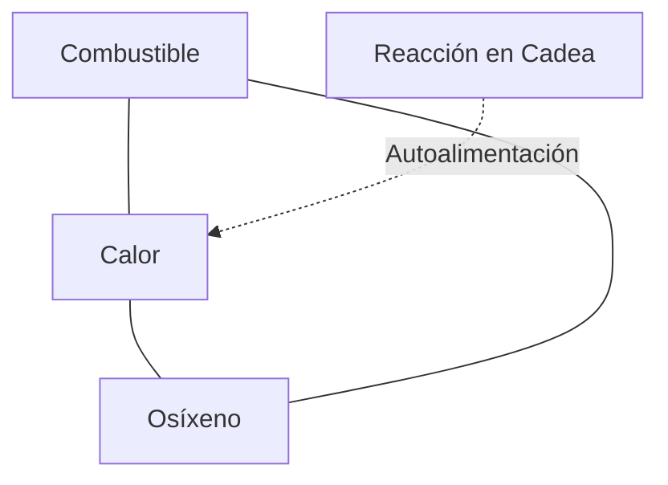
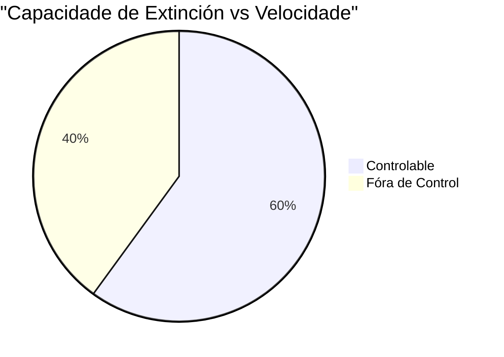

# Tema 4 Específico: Comportamento do Lume e Tipos de Incendios 🔥

*Versión V10 GOLD PREMIUM. Manual técnico sobre os principios do lume, factores de comportamento e clasificación de incendios. Contido certificado 100% Inexpugnable con estética Premium.*

---

## 1. PRINCIPIOS BÁSICOS DO LUME FORESTAL

Para que se inicie un lume, deben estar presentes o combustible, o comburente (osíxeno) e a calor. Unha vez iniciado, o seu comportamento está influenciado pola triada do combustible, a meteoroloxía e a topografía.

### 1.1 Definicións Técnicas Clave
- 🌲 **Incendio Forestal:** Segundo a Lei 3/2007, de prevención e defensa contra os incendios forestais de Galicia, é o lume que se estende sen control sobre combustibles forestais situados no monte, incluídos os enclaves forestais localizados en terreos agrícolas, calquera que sexa a súa extensión.
- 🔥 **Lume:** Fenómeno producido ao aplicar calor a unha substancia combustible en presenza de osíxeno, elevando a súa temperatura ata a emisión de gases.
- ⚗️ **Combustión:** Reacción físico-química de oxidación-redución.
- ⚡ **Ignición:** Inicio da combustión autoalimentada. A **temperatura de ignición** é a mínima necesaria para que un combustible comece a arder sen chama exterior (autoignición), mentres que a **inflamación** (aparición da chama) pode ocorrer a temperaturas inferiores se existe un aporte de calor externo.

### 1.2 Triángulo e Tetraedro do Lume

- **O Triángulo:** Composto por combustible, osíxeno e calor.
- **O Tetraedro:** Engade a **reacción en cadea**, que é a enerxía de activación que autoalimenta o proceso. Aproximadamente o **15% da enerxía liberada** durante a combustión emprégase para autoalimentar o proceso, mentres que o **85% restante** quenta a atmosfera e os combustibles máis próximos.

### 1.3 Fases da Combustión
1.  **Prequentamento:** A calor exterior eleva a temperatura ata os **100ºC**, eliminando a auga e destilando resinas.
2.  **Combustión dos Gases:** Entre **300-400ºC** despréndense gases inflamables. A temperatura ascende de 600 a 1.000ºC coa aparición de chama azulada e fumes (CO2 e vapor de auga).
3.  **Combustión do Carbón:** Consumo do contido en carbono ata quedar reducido a cinzas.

### 1.4 Transmisión de Calor
- **Condución:** Contacto directo entre moléculas (a madeira ten baixa condutividade).
- **Radiación:** A través de ondas electromagnéticas.
- **Convección:** A través dun fluído (aire) que transporta a calor de xeito ascendente.
- **Transmisión Indirecta:** Mediante **Material Rodante** (piñas, troncos) ou **Focos Secundarios** (pavesas transportadas polo vento).

---

## 2. O COMBUSTIBLE: O FACTOR INTERVÉN 🌿

O combustible é o único factor do comportamento do lume sobre o que o Servizo de Prevención e Defensa contra os Incendios Forestais (SPDCIF) pode intervir directamente.

### 2.1 Clasificación e Características
- **Estado Vital:** Vivos (herbas, árbores) ou Mortos (tocos, pólas).
- **Composición (Diámetros):** Lixeiros (< 5mm), Regulares (5-25mm), Medianos (25-75mm) e Grosos (> 75mm).
- **Posición:** Subterráneos (raíces), Superficiais (< 1,5m) e Aéreos (> 1,5m).
- **Dispoñibilidade:** Diferenza entre o combustible total e o que realmente está en condicións de arder segundo a súa humidade e tamaño.

### 2.2 Conceptos de Humidade
- **Tempo de Retardo:** É o tempo necesario para que un combustible chegue ao equilibrio do seu contido de humidade co que hai na atmosfera.
- **Humidade de Extinción:** Valor por riba do cal non hai combustión con lapa. En combustibles mortos sitúase entre o **25-40%**, e en vivos entre o **120-160%**.
- **Límite de Ignición:** Considérase combustible morto aquel con menos do **30% de humidade**.

### 2.3 Modelos de Combustible de Rothermel
Clasificación normalizada de 13 modelos distribuídos en 4 grupos:

| Grupo | Modelos | Descrición Breve | Carga (t/ha) |
| :--- | :--- | :--- | :--- |
| **🌾 Pastos** | 1, 2, 3 | Dende pasto fino baixo ata pasto groso e alto (> 1m). | 1 - 10 |
| **🌿 Matos** | 4, 5, 6, 7 | Mato alto (Mod 4), baixo (Mod 5) ou sotobosque (Mod 7). | 7 - 36 |
| **🌳 Bosques** | 8, 9, 10 | Follaxe compacta (Mod 8), solta (Mod 9) ou con leña (Mod 10). | 6 - 35 |
| **🪓 Refugallos** | 11, 12, 13 | Restos de poda lixeiros ata grandes acumulacións pesadas. | 22 - 150 |

---

## 3. METEOROLOXÍA E O VENTO 🌦️

### 3.1 Dinámica Atmosférica
> [!CAUTION]
> **A REGRA DO 30:** Humidade Relativa (HR) < 30%, Temperatura > 30ºC e Vento > 30 km/h son os factores da gran propagación.

- **Humidade Relativa (HR):** Valores **inferiores ao 30%** son críticos para a propagación.
- **Punto de Rocío:** Temperatura á que o aire chega á saturación.
- **Altitude:** A temperatura descende de media **0,64º C cada 100 metros**.

### 3.2 O Vento e a Capacidade de Extinción
> [!IMPORTANT]
> **VELOCIDADE CRÍTICA:** Establécese en **50 metros por minuto** (segundo o Test FORGA 18/11/2025). A partir deste valor, o incendio supera a capacidade de extinción dos medios terrestres e considérase incontrolable.

- **Velocidade:** Mídese con anemómetro (Escala Beaufort de 0 a 12).
    - 🔵 **Forza 0-3:** Calma a brisa frouxa (< 19 km/h).
    - 🟡 **Forza 4-5:** Brisa moderada a fresca (20-38 km/h).
    - 🟠 **Forza 6-7:** Vento fresco a forte (39-61 km/h).
    - 🔴 **Forza 8-12:** Temporal a Furacán (> 62 km/h).

### 3.3 Ventos Locais e Fenómenos Especiais
- **Ventos de Ladeira:** Ascendentes/Anabáticos (día, 6-12 km/h) e Descendentes/Catabáticos (noite, 5-10 km/h).
- **Ventos de Val:** Máxima intensidade de día (16-30 km/h).
- **Inversión Térmica:** Formación dun **cinto térmico** a uns 2/3 da altura do val.
- **Efecto Foehn:** Vento cálido e seco que descende por sotavento, aumentando drasticamente a virulencia.
- **Tronadas Convectivas:** Fases de formación, maduración (ventos erráticos e raios) e disipación.

---

## 4. TOPOGRAFÍA E TIPOLOXÍA DE LUMES ⛰️

### 4.1 Influencia da Pendente
A pendente inflúe **directamente** na velocidade de propagación. O lume prequenta os combustibles superiores por proximidade da chama (radiación e convección), multiplicando a velocidade de avance ladeira arriba.

### 4.2 Clasificación Segundo o PLADIGA 2025
- 🟢 **Conato:** Superficie <= 1 ha (e arborada <= 0,5 ha).
- 🟠 **Incendio Forestal:** Arborada > 0,5 ha ou superficie total > 1 ha.
- 🔴 **Queima:** Só superficie rasa > 1 ha.

### 4.3 Estados do Lume
- ⚠️ **Estabilizado:** Evoluciona dentro das liñas de control sen superalas.
- 🛑 **Controlado:** Illado e sen chamas no seu perímetro.
- ✅ **Extinguido:** Sen materiais en ignición, sen fume e sen posibilidade de reprodución.

---

## 5. EVOLUCIÓN HISTÓRICA (XERACIÓNS)

- **1ª e 2ª:** Impulsados por vento e topografía (ata 10.000 ha).
- **3ª:** Columnas convectivas e lumes de copas (fóra de control).
- **4ª e 5ª:** Afección a zonas de **Interfaz Urbano-Forestal (IUF)** e mega-incendios simultáneos.
- **6ª:** Tormentas de lume (**PyroCumulonimbus**) que modifican a meteoroloxía local.

---

## 🎯 MATRIX DE SEGURIDADE (REPASO 100% APTO)

| Punto de Fricción | Resposta Blindada (Literalidade Exame) |
| :--- | :--- |
| **Tempo de Retardo** | ⏲️ Rapidez en acadar o equilibrio de humidade coa atmosfera. |
| **Humidade de Extinción** | 💧 > 25-40% (Mortos) / > 120-160% (Vivos). |
| **Velocidade Crítica** | ⏱️ **50 metros por minuto** (Test FORGA). |
| **Límite Combustible Morto** | 🥀 **30% de humidade**. |
| **Prazos PLADIGA** | 🟢 <= 1ha (Conato) / 🟠 > 1ha (Incendio). |
| **Cinto Térmico** | 🌡️ Situado a **2/3 da altura** do val nunha inversión. |
| **Cor do Fume** | ⚪ Branco (Pastos), 🔘 Gris (Mato), ⚫ Negro (Pouco osíxeno). |
| **Modelo Rothermel 5** | 🌿 Mato baixo e verde (< 1m). |