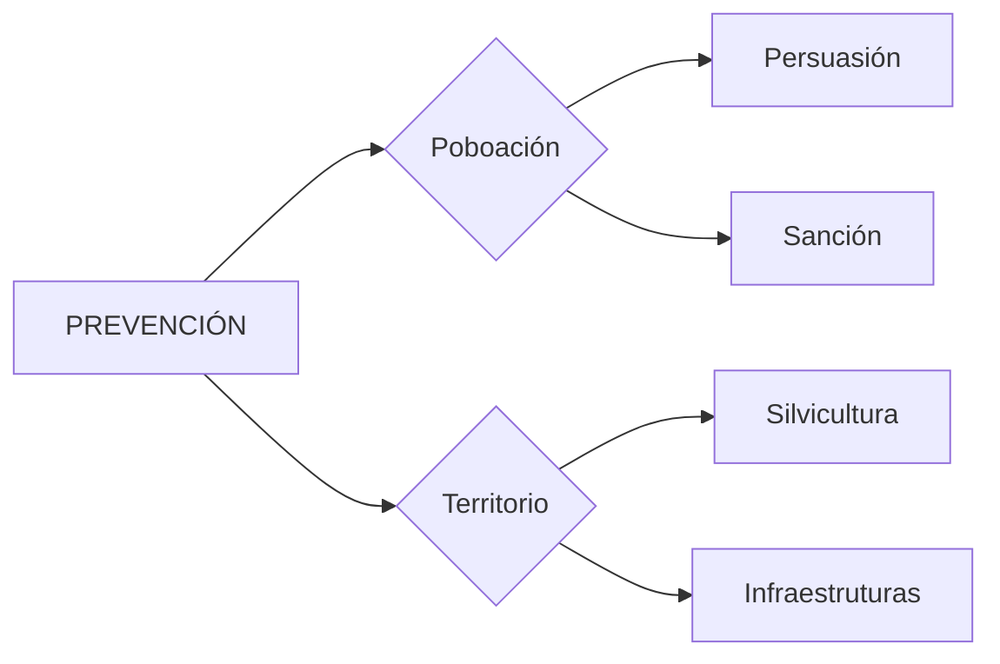

# T6 Específico: Accións de Prevención (Fuente de Verdad 2025) 🛡️

*Versión V10 GOLD PREMIUM. Manual de PRECISION QUIRÚRGICA. Este documento mantén o modo narrativa ("letra") íntegro sen simplificacións, con reforzo visual Premium.*

---

## 1. CONCEPTO E LÓXICA DA PREVENCIÓN

A prevención de incendios forestais non é un acto illado, senón o **conxunto de actividades** que teñen por obxecto:
1. 🎯 **Reducir ou anular a probabilidade** de que se inicie un lume (actuando sobre a calor).
2. 🛡️ **Limitar os seus efectos** se chega a producirse (actuando sobre o combustible).

### 1.1 Os dous piares da estratexia
- 👥 **Accións sobre a poboación:** Buscan evitar o inicio do lume mediante a **Persuasión**, a **Conciliación de intereses** e a **Persecución/Sanción**.
- 🗺️ **Accións sobre o territorio:** Modifican a estrutura da vexetación para dificultar a propagación. Divídese en **Silvicultura preventiva** e **Infraestruturas**.

---

## 2. AS CAUSAS DOS INCENDIOS FORESTAIS 🔍

O manual distingue entre causas estruturais (raíces) e causas inmediatas (detonantes).

### 2.1 Causas Estruturais
Son condicións intrínsecas do territorio, permanentes ou de difícil modificación. Non inician o lume pero inflúen no seu comportamento:
- 🐄 **Uso tradicional do lume:** Cultura de queimas agrícolas/gandeiras moi arraigada no medio.
- 🌦️ **Condicións climáticas:** Secas prolongadas, temperaturas extremas e ventos persistentes.
- 🏚️ **Abandono do medio rural:** Tradúcese nunha gran acumulación de combustible (mato e restos) preto de zonas habitadas.
- 🌲 **Alta inflamabilidade:** Galicia conta cunha gran densidade de especies de rápida propagación.

### 2.2 Causas Inmediatas
Existen 5 tipos definidos: **Raios, Neglixencias, Accidentes, Intencionados e Reproducións.** Se unha ignición non se pode clasificar en ningunha destas categorías, considérase de **causa descoñecida**.

---

## 3. ARQUITECTURA LEGAL E COMPETENCIAL (LEI 3/2007)

### 3.1 O Sistema de Prevención e Defensa (Art. 4)
Este sistema está formado por un conxunto de medidas de sensibilización, planificación, vixilancia, detección, combate e control. A Xunta de Galicia ten a obriga de levar un **rexistro cartográfico e informático** das superficies queimadas e das redes de defensa.

### 3.2 Competencias: ¿Quén manda aquí? 👮
- 🏛️ **Xunta de Galicia (Consellería / Consello):**
    - Ten a competencia na xestión de redes **Primarias e Terciarias**.
    - É a responsable da **Declaración de Zonas de Alto Risco (ZAR)** e das épocas de perigo.
    - Encárgase de regular o uso do lume e da divulgación do **IRDI**.
- 🏘️ **Entidades Locais (Concellos):**
    - Deben aprobar os **Plans Municipais** (que deben estar integrados no PEMU).
    - Teñen a competencia directa sobre as redes **Secundarias** e as faixas das estradas municipais.
    - Autorizan o uso de **foguetes e fogos artificiais**, debendo informar ao distrito forestal con **48h de antelación**.
    - Conceden autorizacións de lume para **Festas Locais** ou eventos de tradición popular.

### 3.3 Xerarquía do Planeamento (Art. 13-17)
1. 🗺️ **Nivel Galego (PLADIGA):** Define eixos estratéxicos e o orzamento galego.
2. 🏗️ **Nivel Distrito:** Plans de prevención de distrito. Son aprobados polo **Conselleiro**.
3. 🏘️ **Nivel Municipal:** Plans municipais correntes. Requíren un informe preceptivo e **vinculante** da Dirección Xeral competente.

---

## 4. ÍNDICES E ZONAS DE RISCO 📊

### 4.1 Métrica IRDI (Prognóstico Diario)
- **Resolución Espacial:** Malla de **200 metros**.
- **Cálculo Local:** Cando un concello ten varias mallas, úsase o valor do **Percentil 50** (valor mediano) para determinar o nivel oficial do concello.
- **Horizonte:** Prognóstico a **10 días**.

### 4.2 Roles na Queima Prescrita (J.A. Vega)
- **Xefe de Queima:** Único que ordena iniciar ou suspender a manobra. É a dirección facultativa da operación.
- **Responsable de Ignición:** Encárgase de dirixir aos operarios que portan os fachos de goteo.
- **Responsable de Control:** Asegura todo o perímetro e coordina os medios de extinción presentes.

---

## 5. FERRAMENTAS MOTORIZADAS E SEGURIDADE ⚙️

### 5.1 Motoserra e Motorrozadora (Seguridade C2)

| Máquina | Elemento | Métrica / Función |
| :--- | :--- | :--- |
| **🪚 Motoserra** | Afilado | Ángulo de **30º - 35º** (fío de cadea). |
| **🪚 Motoserra** | Seguridade | Freo de cadea, Captor de cadea, Bloqueo de gatillo, Protexe-mans. |
| **🪚 Motoserra** | Mantemento | Limpar filtro de aire (cada xornada) e Xiro da espada. |
| **⚔️ Motorrozadora**| Distancia | **15 metros** de separación obrigatoria entre operarios. |
| **⚔️ Motorrozadora**| Disco | **Zona A (12h a 3h)**: Corte seguro. **Zona B (9h a 12h)**: Rebote (Kickback). |
| **⚔️ Motorrozadora**| Mantemento | **Engraxar cabezal** (1 vez ao día). |
| **⚔️ Motorrozadora**| Seguridade | Protector de corte, Gatillo stop, Arnés con desprendemento rápido. |

> [!CAUTION]
> **O DISPARO DA COITELA (KICKBACK):** Evitar as zonas **B e D (9h a 12h)** do disco de serra circular, xa que producen o rebote ou "patada" lateral ao tocar obxectos ríxidos. A **Zona C** considérase a máis perigosa.

---

## 6. XESTIÓN DA BIOMASA: REDES DE FAIXAS �

### 6.1 Distancias Regradas
| Rede | Ámbito / Obxectivo | Distancia Regrada |
| :--- | :--- | :--- |
| **🌀 Primaria (Gas)** | Liñas de transporte/distribución. | **1 metro** a cada lado do eixe (Art. 20 bis). |
| **⚡ Primaria (Elec)** | Proxección condutores externos. | **5 metros** dende a proxección. |
| **🌬️ Primaria (Eólica)**| Aeroxeneradores e pistas eólicas. | **5m** aresta (Pistas) / Área ao redor da torre. |
| **🏠 Secundaria** | Protección de núcleos e edificacións. | **50 metros** arredor do perímetro. |
| **🏞️ Terciaria** | Áreas recreativas e camiños. | **50m** (Áreas recr.) / **2m** dende aresta (Camiños). |

### 6.2 Refurzo Legal: Art. 10 e 24 bis
- **Art. 10 (ZAR):** Declaradas pola Consellería (Pladiga) baseándose na **Reiteración de lumes** e na **Virulencia/Especial Perigo**.
- **Art. 24 bis (Amoreamentos):** Durante Xullo-Setembro, os restos de corta en cargadoiro (biomasa/estelas) requiren área limpa de **5 metros** ao redor.
- **Xestión de Especies:** Nas faixas de 50m é obrigatorio o **clareo de copas (7m de separación)** en pinos/eucaliptos e a eliminación de **especies prohibidas** (Mimosas/Acacias).
- **Art. 16/22 (Subsidiariedade):** Concellos poden actuar se o titular non limpa. Prazos: **31 de maio** (Xeral) / **1 de abril** (Reincidentes).

### 6.3 Prazos e Multas Coercitivas
- 📅 **Data límite ordinaria:** **31 de maio**.
- ⚠️ **Prazos de limpeza:** **15 días naturais** tras a notificación previa.
- 💰 **Multas:** **900€ por hectárea** (mínimo 100€). Son reiterables cada **3 meses**.

---

## 7. QUEIMAS CONTROLADAS E PRESCRITAS 🔥

### 7.1 Marco Normativo e Prazos (Decreto 105/2006)
- **Comunicación (Restos Agrícolas):** Só válida en **Época de Perigo Baixo**. Mínimo **2 días** de antelación.
- **Autorización (Restos Forestais):** Mínimo **7 días** de antelación. En perigo medio/alto, os agrícolas tamén adoitan requirir autorización ou estar prohibidos.
- **Extinción:** A queima non se iniciará antes de saír o sol e estará extinguida **2 horas antes** da posta do sol. É obrigatoria unha devasa de **5 metros** rodeando o perímetro.

### 7.2 Métrica do Facho de Goteo
- **Mestura:** 2/3 Gasóleo (base térmica) e 1/3 Gasolina (ignición). **Nunca 100% gasolina** polo perigo de explosión.
- **Capacidade:** Xeralmente de 3,8 a 5 litros.
- **Compoñentes Clave:**
    - **Ignitor (Serpentín/Estopín):** Prende a mestura antes de que caia ao chan.
    - **Respiradeiro:** Permite a entrada de aire para compensar a saída de combustible.
    - **Válvula de seguridade:** Evita fugas ou retornos de chama perigosos.
- **Configuracións de Traballo:**
    - **1-2-3 (Habitual):** Facho 1 máis avanzado (preto da liña de control), seguido polo 2 e o 3.
    - **3-2-1 (Menos común):** O facho 3 vai por diante (uso en lume de flanco).
    - **Orde "50-5":** Separación de 50m entre operarios e ancho de franxa de 5m.

### 7.3 Técnicas de Ignición
| Técnica | Descrición / Uso |
| :--- | :--- |
| ⭕ **Circular (Anel)** | Aplicación perimetral cara ao centro. Crea un "efecto de succión" que atrae o lume ao medio. |
| ⬆️ **Central (Convección)** | Ignición forte no centro da parcela. Xera unha columna térmica (convección) que detén o avance exterior. |
| 📐 **En Cuña (Chevron)** | Ignición en forma de "V" ladeira abaixo. Ideal para outeiros ou zonas sen vento. |
| 📏 **Por Faixas (Tiras)** | A técnica máis usada. Ignicións en liñas paralelas ao cortalumes (a favor ou en contra). |
| 📍 **Por Puntos** | Aplicación de puntos de lume illados en zonas de mato ralo ou difícil acceso. |

### 7.4 Ventá de Prescrición (José Antonio Vega)
- **Vento (a 2m):** 2 - 12 km/h.
- **Temperatura:** 0 - 15 ºC.
- **Humidade:** 30% - 60%.
- **Días sen choiva:** Mínimo 1 día (Fernandes estima óptimo 14 días).

---

## 8. FERRAMENTAS MANUAIS 🛠️

| Ferramenta | Peso | Lonxitude | Ángulo Afilado / Notas |
| :--- | :--- | :--- | :--- |
| **🎒 Mochila** | < 20 kg | 17 L (hab) | Aplicación chorro/pulverización. Max 1.5m altura chama. |
| **🧹 Batelumes** | < 2,5 kg | 2.0 m total | Pala 25x50cm. Sufocación. Max 1.5m altura chama. |
| **⛏️ Pá Forestal** | 2,0 kg | 1.25-1.30 m| Afilado **45º** na parte cóncava. |
| **🪓 Pulaski** | 2,0 kg | 90 cm (max) | Afilado: **30º** (machada) / **45º** (aixada). |
| **🧹 McLeod** | 2,2 kg | 124 cm | Afilado **45º** no lado **exterior** (impide penetrar moito). |
| **🛠️ Gorgui** | 2,5 kg | 1.2 m | Cabezal intercambiable (Pulaski/McLeod/Pico/Batelumes). |

---

## 9. INTERFACE URBANO-FORESTAL (IUF) 🏠

- **Plan de Autoprotección:** Obrigatorio para núcleos a menos de **400m** do monte.
- **Aldeas Modelo:** Proxecto para reducir o risco mediante produción agraria (acordo do 70% dos propietarios e banco de terras por 10 anos).
- **Convenio Xunta-Fegamp-Seaga:** Xestión de faixas secundarias. Os Concellos poden solicitar a execución subsidiaria de ata **10 ha/ano** e a limpeza de **12 km/ano** de vías municipais.

---

## 🎯 MATRIX DE SEGURIDADE (REPASO 100% APTO)

| Punto de Fricción | Resposta Blindada (Literalidade Exame) |
| :--- | :--- |
| **Gasolina Facho** | **25 - 30%** (Nunca 100% gasolina polo perigo de explosión). |
| **Altura Chama Manual** | **1.5 metros** (Límite para uso de batelumes e mochila). |
| **Maio 31** | Toque de queda ordinario para limpeza de biomasa. |
| **900 € / Ha** | Valor da multa (Mínimo 100€, reiterable cada 3 meses). |
| **2 Horas** | Tempo antes da posta do sol para ter extinguidas as queimas. |
| **48 Horas** | O Concello debe avisar ao Distrito forestal do uso de foguetes. |
| **Afilado McLeod** | Afíase pola parte **EXTERIOR**. |
| **Kickback (Motorr.)** | Provocado pola **Zona B (9h-12h)** do disco. |
| **Clareo Copas** | **7 metros** de separación obrigatoria en pinos/eucaliptos. |

---

## 🚨 TIPS DE EXAME
1.  **Afilado Motoserra:** Na motoserra, o valor SPIF de referencia é **35º**.
2.  **Peso Mochila:** O peso máximo con carga **non superará os 20 kg**.
3.  **Configuración 3-2-1:** Menos habitual, específica para lume de flanco ou tácticas defensivas.
4.  **McLeod vs Pulaski:** O McLeod afíase por fóra; na Pulaski o afilado é diferente segundo o lado (30º/45º).
5.  **Gabinete Provincial:** O **Xefe de Distrito NON** forma parte del.
6.  **Percentil 50:** É o valor mediano que determina o IRDI oficial nun concello con varias mallas.
