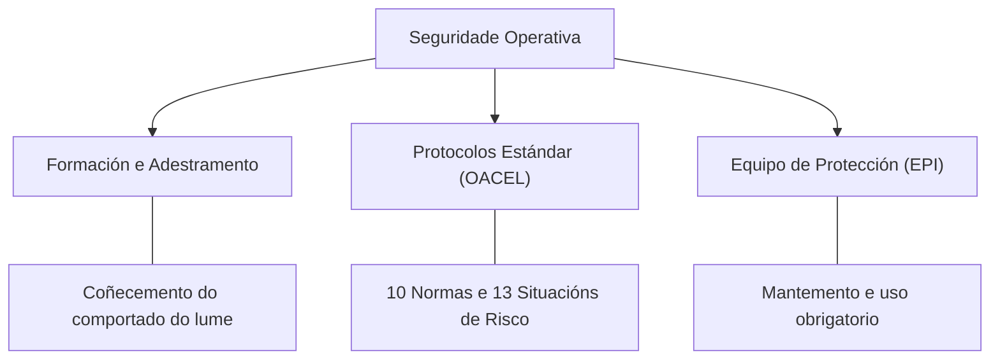
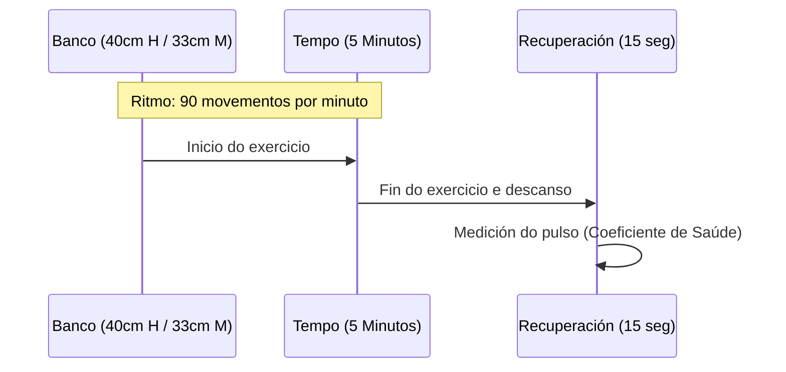
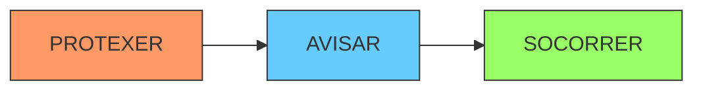

# Resumo: Seguridade e Saúde Operativa

Riscos específicos na extinción, protocolos de seguridade no traballo e directrices de actuación ante emerxencias.

---

## CAPÍTULO 1: MARCO XERAL E FILOSOFÍA DA SEGURIDADE 🌳🔥

A seguridade na loita contra os incendios forestais non é un protocolo secundario, senón o sistema operativo sobre o que se basea calquera acción táctica. Debido á contorna hostil (calor estrema, fume, terreo abrupto e estrés), a **Lei 31/1995, do 8 de novembro, de prevención de riscos laborais**, e o seu desenvolvemento normativo, esixen un control estrito da formación e a documentación operativa.

### Os Tres Piares da Seguridade Operativa
Para que unha operación sexa segura, deben confluír tres factores:

#### Factores de Risco Humano (O Triángulo do Perigo)
A maioría dos accidentes non ocorren por fallos mecánicos, senón por factores humanos que deben ser monitorizados constantemente polo **Xefe de Brigada**:
1.  **Ignorancia:** Falta de formación técnica ou descoñecemento do terreo.
2.  **Confianza excesiva:** Subestimar a capacidade de avance do lume.
3.  **Cansazo:** Diminución da capacidade de atención física e psíquica.

---

## CAPÍTULO 2: SELECCIÓN E APTITUDE FÍSICA DO PERSOAL 🏃‍♂️📊

O acceso ao SPIF require unhas condicións físicas e psicolóxicas específicas, xa que o traballo en extinción esixe un esforzo aeróbico e muscular de alta intensidade.

### Requisitos de Acceso e Selección
| Criterio | Requisito Técnico | Observacións |
| :--- | :--- | :--- |
| **Idade** | 18 a 60 anos | Brigadas de reforzo/especiais: Preferencia 20-35 anos. |
| **Saúde** | Recoñecemento médico | Excluíntes: Patoloxías cardíacas ou respiratorias graves. |
| **Psicoloxía** | Exame Psicotécnico | Medición de intelixencia, rapidez perceptiva e comprensión. |
| **Aptitude** | Proba do Banco | Medición do coeficiente de saúde e recuperación. |

#### A Proba do Banco (Métrica de Resistencia)
É o estándar para medir a capacidade aeróbica do persoal de extinción:

> [!IMPORTANT]
> **Valores de Apto (Coeficiente de Saúde):**
> - **Brigadas Especiais (Reforzo):** Maior de **45**.
> - **Brigadas Normais (SPIF):** Maior de **40**.

---

## CAPÍTULO 3: PROTOCOLOS DE SEGURIDADE NO COMBATE 🚨🛡️

O Manual de Extinción define dous listados críticos que todo bombeiro forestal debe memorizar para evitar o atrapamento.

### As 10 Normas de Seguridade (O Decálogo)
Son as regras proactivas de ouro:
1.  **Información:** Observar sempre as condicións climáticas.
2.  **Conciencia:** Saber que sucede ao redor en todo momento.
3.  **Anticipación:** Pensar que pode facer o lume antes de actuar.
4.  **Escape:** Ter **sempre** preparada unha ruta de escape cara a unha zona segura.
5.  **Vixilancia:** Evitar actuar en lugares sen saída clara.
6.  **Calma:** Manter a concentración e a decisión en momentos críticos.
7.  **Contacto:** Non perder nunca o contacto co grupo ou a cuadrilla.
8.  **Claridade:** Se as instrucións non son claras, solicitar aclaración.
9.  **Mando:** Manter o control do persoal e a xerarquía.
10. **Prioridade:** Actuar con agresividade táctica, pero a seguridade é o **primeiro**.

### As 13 Situacións de Perigo (Bandeiras Vermellas)
Se detectas unha destas, detén a operación e re-avalia:
*   Construción de liña costa abaixo.
*   Presenza de material rodante.
*   Cambios bruscos de vento ou tempo caloroso e seco.
*   Combustible sen queimar entre o persoal e o incendio.
*   Terreo ou factores locais descoñecidos, especialmente de noite.
*   Non ver o incendio principal nin ter comunicación co mando.

---

## CAPÍTULO 4: SEGURIDADE EN AERONAVES E VEHÍCULOS 🚒🚁

### Precaucións co Helicóptero
O traballo con medios aéreos é de alto risco pola presenza de rotores e descargas.
*   **Radio de Prohibición:** Non fumar nin achegarse a menos de **30 metros** do aparello.
*   **Aproximación:** Sempre pola fronte ou os laterais, nunca polo rotor de cola, e sempre baixo a vista do piloto.
*   **Embarque:** Seguir as instrucións do técnico ou piloto. Suxeitar ben ferramentas e cascos.

### Seguridade en Maquinaria Pesada e Motobombas
*   **Distancia de Seguridade:** Manter unha separación mínima de **4 veces a altura da vexetación** respecto ao lume.
*   **Posicionamento:** Estacionar sempre o vehículo de **cara á saída** e con comunicación radio operativa.
*   **Ponto Baixo:** Coidado coa carcasa do diferencial en terreos abruptos.
*   **Motobombas:** Estacionar lonxe da radiación directa e con rutas de escape despexadas.

---

## CAPÍTULO 5: O PROTOCOLO PAS (ACTUACIÓN EN ACCIDENTES) 🚑🆘

Ante calquera accidente no monte, a secuencia de actuación é inalterable para garantir que o socorro non cause máis vítimas.

1.  **PROTEXER:** Asegurar o lugar (cortar tráfico, vixiar o lume) para que ti, o ferido e o entorno esteades seguros.
2.  **AVISAR:** Chamar ao **112** ou comunicar polo canal de emerxencia do operativo ao **CCD (Centro de Coordinación de Distrito)**.
3.  **SOCORRER:** Aplicar as técnicas de primeiros auxilios (RCP, hemorraxias) só se tes a formación e medios necesarios.

---

## CAPÍTULO 6: MATRIX DE SEGURIDADE E FLASH-MÉTRICAS 🚨💎

Este capítulo consolida as cifras "inexpugnables" que definen un **APTO GOLD** no exame.

### Flash-Métricas de Seguridade Operativa:

| Concepto | Valor Técnico | Unidade |
| :--- | :--- | :--- |
| **Xornada Máxima (Día 1)** | **12** | Horas |
| **Descanso Mínimo (Quendas)** | **8** | Horas |
| **Seguridade Helicóptero** | **30** | Metros (Radio) |
| **Velocidade de Escape** | **60** | m/min |
| **Carga Máx. Home (Habitual)** | **25** | Kg |
| **Carga Máx. Muller (Habitual)** | **15** | Kg |
| **Presión Escala 25mm (Traballo)**| **40** | bar |
| **Ponto Baixo Vehículo** | **Carcasa Diferencial** | --- |
| **Distancia Lume (Seguridade)** | **4 veces altura vexetación** | --- |
| **Tempo de Ouro (Atrapamento)** | **3 a 5** | Minutos |

### Certificacións UNE (Normativa 2025):
*   **Mono de Extinción:** UNE-EN ISO 15384:2020.
*   **Botas de Seguridade:** UNE-EN 15090:2012.
*   **Dosifor (Aditivos):** Humectante (**0,2% - 0,4%**), Espumóxeno (**0,5% - 1%**).

> [!TIP]
> **OACEL** é o teu escudo: **O**bservación, **A**tención, **C**omunicación, **E**scape e **L**ugar Seguro. Se falla un, falla o sistema.