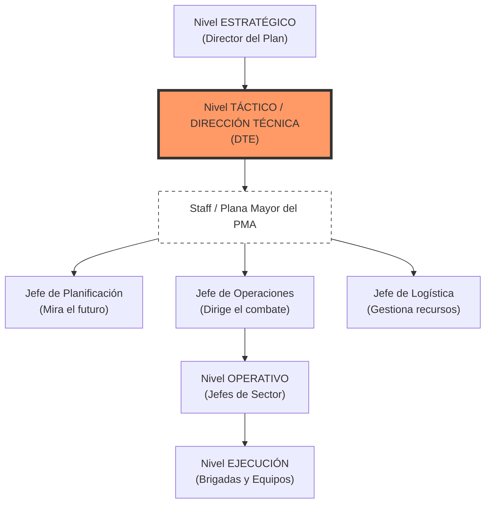

# Tema 3: SEMOP (Sistema Estrutural de Mando Operativo) - PREMIUM 🏆

> [!IMPORTANT]
> **Definición Crítica:** El SEMOP es el procedimiento estandarizado de la Xunta de Galicia para la organización de la respuesta en incendios forestales, basado en el **ICS (Incident Command System)**. Busca garantizar el **Mando Único** y el **Tramo de Control** (óptimo 5 unidades).

## 1. Estructura Jerárquica y Organigrama

## 2. Perfiles y Funciones Clave

| Figura | Perfil Típico | Funciones Principales |
| :--- | :--- | :--- |
| **DTE (Director Técnico Extinción)** | Agente Ambiental / Técnico Distrito / UDEX | Máxima autoridad en el incendio. Elabora el **Plan de Operaciones**. Decidide el cambio de Nivel de Gravedad. |
| **Jefe de Operaciones** | Técnico / Agente con experiencia | Traduce el plan estratégico en órdenes tácticas. Dirige a los Jefes de Sector y medios aéreos. |
| **Director del PMA** | DTE (en Niveles 0/1) | Coordina todas las actividades en el Puesto de Mando Avanzado. En Situación 2 puede ser una figura distinta designada. |
| **Jefe de Sector** | Agente Ambiental | Gestiona un área territorial específica (Sector). Controla entre 3 y 5 equipos. |

## 3. El PMA (Puesto de Mando Avanzado)
El "cerebro" sobre el terreno. Se desplaza en vehículos de comunicaciones específicos.

*   **Planificación (Ojo):** Analiza meteo y comportamiento del fuego.
*   **Operaciones (Brazo):** Ejecuta la extinción.
*   **Logística (Estómago):** Gestiona comida, combustible y el **PRM**.

> [!TIP]
> **Dato de Examen:** El **PRM (Punto de Recepción de Medios)** es obligatorio desde el **Ataque Ampliado (Nivel B)**. Su función es el check-in de medios y asignación inicial.

## 4. Dinámica del Mando según Niveles

### Ataque Inicial (Nivel A)
*   **Mando Único:** El DTE asume todas las funciones (Planificación, Operaciones y Logística).
*   **Comunicación:** Directa entre DTE y Medios.

### Ataque Ampliado (Nivel B/C)
*   **Sectorización:** El incendio se divide en sectores por carga de trabajo.
*   **Delegación:** El DTE delega en el Jefe de Operaciones para centrarse en la estrategia global.
*   **Flujo de Información:** Los medios informan al Jefe de Sector -> Este al Jefe de Operaciones -> Este al DTE.

## 5. Matices Técnicos para "Francotiradores" (Test)
1.  **UDEX:** Unidad de Directivos de Extinción. No dependen de los distritos, intervienen en incendios de alta complejidad.
2.  **Tramo de Control:** Un mando no debe dirigir a más de 7 unidades. El número ideal es **5**.
3.  **Identificación de Sectores:** Se usan letras (Flanco Izquierdo: A, B...) y números (Flanco Derecho: 1, 2...).
4.  **Agente de la Autoridad:** El DTE tiene esta condición legal durante el incendio para dar órdenes de obligado cumplimiento.

---
> *Este contenido está diseñado para ser visualizado en el Dashboard como una serie de 5 slides interactivas.*
